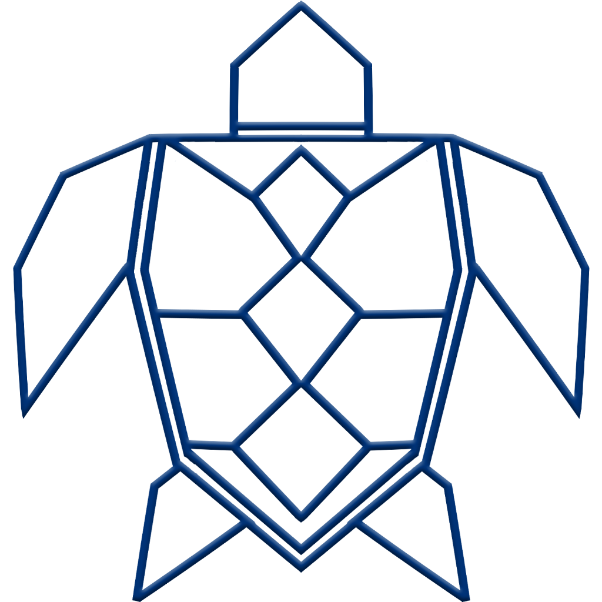


# Tackle - a Cybersecurity Project

**Where are my current weak points? How can I secure them?**

Tackle is a web-based [Laravel](https://laravel.com) based network simulator developed to help small and medium-sized enterprises (SMEs) improve their IT and OT security measures. The tool offers the possibility to create digital twins of IT/OT systems and simulate cyber attacks in order to identify security gaps and take appropriate measures.

Tackle lets you reconstruct your own production site in a very innovative way easily by drag and drop. Afterwords you can let some fictive attacks run over it and you will be shown whether your production IT is secure, what security level you have and what measures you need to take, to get to the next security level.

<!-- TOC -->
* [Tackle - a Cybersecurity Project](#tackle---a-cybersecurity-project)
  * [Screenshots](#screenshots)
  * [Installation](#installation)
    * [Prerequisites](#prerequisites)
    * [Installation](#installation-1)
* [Features & Usage](#features--usage)
    * [Profile](#profile)
    * [Maps](#maps-)
    * [Attack simulation](#attack-simulation-)
        * [Simulation sequence in detail](#simulation-sequence-in-detail)
* [Future work](#future-work)
    * [database](#database)
    * [extended learning content](#extended-learning-content)
    * [Logging](#logging)
* [Acknowledgements](#acknowledgements)
  * [Who has worked on this](#who-has-worked-on-this)
* [License](#license-)
<!-- TOC -->

## Screenshots

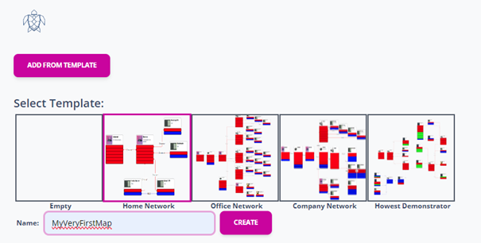

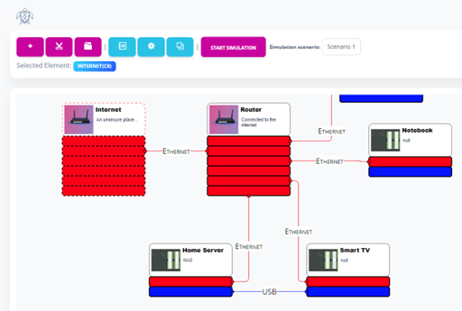

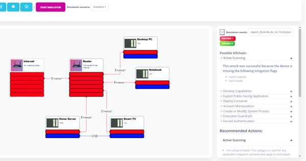

## Installation

### Prerequisites

* [Docker](https://www.docker.com/get-started/) & Docker-compose
* [PHP](https://www.php.net/docs.php) 8.2 or higher
* [NodeJS & NPM](https://docs.npmjs.com/downloading-and-installing-node-js-and-npm)
* [Composer](https://getcomposer.org/)

**Why do I need docker?** We dockerized our database for automized database setup, migration and seed, as well as automized phpmyadmin setup. Feel free to do without Docker if you prefer to use a conventionally installed database. In this case, you would have to adapt your .env file and adapt the start script (or skip the steps in the following instructions).

### Installation

You can use our preconfigured buildAndStartDev.bat file or alternatively perform the following steps.

==Attention: The default passwords specified in the .env and in the docker-compose-dev should definitely be changed!==

On first time run:

```bash
cd src/
copy .env.example .env
php artisan key:generate
```

For starting up the systems (Some steps require a separate CMD window because they run a service.):

```bash
docker-compose build
npm install
docker-compose -f docker-compose-dev.yml up -d 
cd src/
composer install
php artisan serve
npm run dev
```

To set up the database fresh and fill it with test data:
```bash
php artisan migrate:refresh --seed
```

Additionally you can refresh the laravel cache:
```bash
php artisan optimize
```

Tackle should now be available at http://localhost:8000. If you're using Docker, you can also reach PhpMyAdmin for easier database management at http://localhost:8080.

You can login to the platform via: admin@tackle.example | secret

You can stop the system by stopping the running cmd services and by running:
```bash
docker-compose -f ../docker-compose-dev.yml down
```

# Features & Usage

The whole application consists of three main user interfaces:

## Profile
The first interface for the user is the “Profile” where they can decide to create a new profile or work with an existing one. All personnel and organizational measures that have an impact on the actual OT network and do not result from its configuration are queried in the profile. This is implemented with a questionnaire that does not have to be completed in full. A recommended security maturity level is determined on the basis of the questionnaire, default settings are made on the devices and certain “checkmarks are set” if certain attacks are ruled out by the queried measure. The information is saved as a profile.

## Maps 
After completing the profile, the user can create one or more “maps”. This means mapping their network with all devices “as they can see it in production”. The individual devices and connections contain the information required to analyze which IT attacks are successful and where. The information is saved as scenarios/maps. Maps and profiles can be changed independently of each other in order to assess the impact of certain decisions (how secure is the same network with a different password policy).

## Attack simulation 
The attack simulation itself takes place on the same interface. However, with different functions and different graphical feedback. You can select ready-made attack scenarios (from several attack techniques - we have included 5 ready-made scenarios in the project proposal), or you can put together your own attack scenarios from attack techniques. The original access point for the attack must also be selected. On the device accessible from the access point, the vulnerabilities of the device are then checked against the necessary requirements of the attack techniques. If an attacker can gain control of the device, the attack continues on the next connected devices, and so on. Logs are generated for each device, indicating whether the attack techniques were successful and which queries were made to determine this.

Furthermore, after running through an attack simulation, graphical feedback can be generated using the logs (affected devices yellow or red, progress of the attack in the network), but also plain text feedback for each individual device (e.g. when clicking on the device, a text indicating the number of devices hit, which attack had which conditions ("The attacker carried out a port scan [possibly with description text behind hyperlink, and/or with link in the Mitre ATTACK matrix]. This cannot be prevented, but it can be detected. [...] The attacker then carried out a password guessing attack. This was successful. Such attacks are successful if no, too simple or preset logins are used. It can be prevented by setting passwords/changing default passwords on the device.” - etc.).

### Simulation sequence in detail

| Image    | Description |
| -------- | ------- |
|   | The network created is mapped onto a graph. The network devices are the nodes, the network connections are the node connections.    |
| 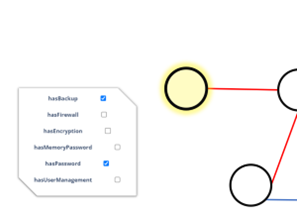  | The corresponding information is stored behind each node.    |
| 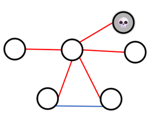  | Step 0: Mark the first infected/hacked (starting) Node.    |
| 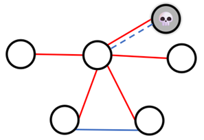  | Step 1: Go to (unmarked) connected node.    |
| 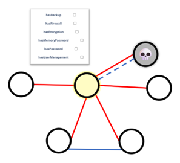  | Step 2: Check node properties and try attacking.    |
| 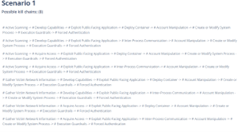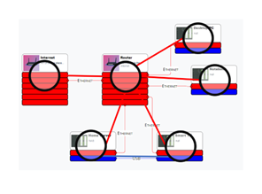  | Step 2.1: Get possible kill chains of select-ed scenario.    |
| 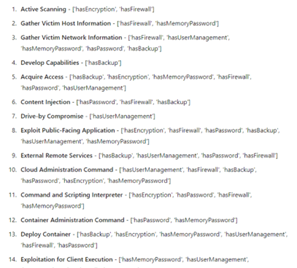  | Step 2.2: Get necessary node properties to prevent attacks of current scenario.    |
| 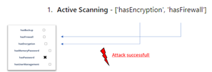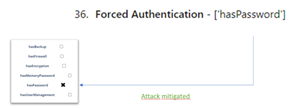  | Step 2.3: Compare node properties with the properties required for the kill chain attacks.    |
| 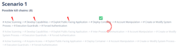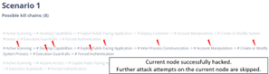  | Step 2.4: Repeat for each kill chain until one kill chain is completely hackable.    |
| 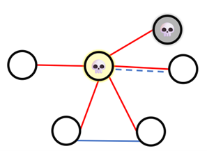  | Step 3: Recursive (like Depth-Search) ap-proach: Start for each unmarked connec-ted Node with Step 1.    |
| 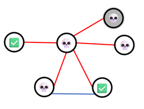  | Final result: The result of a hacking simulation might look something like this.|
| 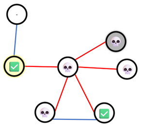  | Case: With non-hacked nodes connected nodes: No effect. All attacks on the highlighted node have been tackled, so the remaining node can-not be reached.|
| 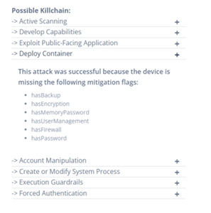  | Step 4: Print results to the user.    |
| 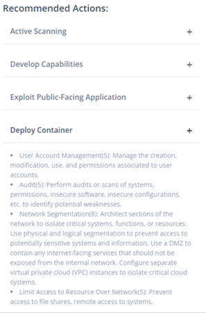  | Step 5: Get affordable mitigation strategies for each attack from MITRE ATT&CK.Affordable meas: We gave each mitigation strategy qualitative effort-value. Depending on the maturity baseline vector of the company profile, the company gets a maximum effort it should consider. We take the maximum baseline value per domain and compare it to the mitigation effort based on the domain of the attack. Mitigations, which would take too much effort to implement, based on the company profile, are omitted.|

# Future work

As following, you will find some extensions we would love to see in the future.

### database
Ideally, it should be possible for the security maturity levels and their properties to be stored as a database. User feedback could then be provided on what needs to be changed in order to reach the next higher level. A comparison of the profile specified in the software with the recommendations for the appropriate maturity level would also be practical. (Your company is x large and works with third-party data, therefore Security Maturity Level 2 is recommended. In the areas x and y, your company only reaches level 1, so the following measures are recommended: ...)

### extended learning content
The final feedback for the user is the learning content. This should be summarized in so-called “learning blocks”. A learning block describes exactly one measure on a device (why is it necessary, how does it work, how is it implemented: password protection is necessary to prevent manipulation. Without password protection, a device is vulnerable to these attacks (from the MITRE ATTACK matrix). Password protection works because it restricts who has read or write access to data on a device and thus prevents unauthorized access. To set a password on a Siemens S7-1200, proceed as follows: ...).

In terms of the application, it is important that these learning blocks are “didactically meaningful”. This means that simple and clear measures, such as setting up a password on a specific device, can be given as step-by-step instructions. More complex measures, such as network segmentation or the use of network monitoring, are more complex and require more understanding of the “why does it work/what does it need to work” and must therefore be explained in this way. For demonstration purposes, reference can also be made to third-party content in individual cases (YouTube videos, for example).

### Logging
Data from the logs can then be used to generate various types of user feedback: This includes the high-value asset/high-risk analysis promised in the project proposal. As additional user input, estimates must be provided here as to how much damage would be caused by a failure of each device and whether any third-party user data would be affected. The analysis only checks which devices are connected and how when traversing the network, which devices can be used to reach particularly valuable targets and where special protection would therefore be necessary.

# Acknowledgements
For this project, we were able to draw on great preparatory work, which we would like to emphasize once again:
* [JointJS](https://github.com/clientIO/joint)
* [Soft UI Dashboard](https://github.com/creativetimofficial/soft-ui-dashboard)
* [Vanilla Context Menu](https://github.com/GeorgianStan/vanilla-context-menu)
* [Sweetalert2](https://github.com/sweetalert2/sweetalert2)
* and many more...

## Who has worked on this
Tackle was developed as part of an EU-funded research project by the following institutions:
* [Institute for Digitalization Aachen](https://ida.fh-aachen.de) at [FH Aachen University of Applied Sciences](https://fh-aachen.de)
* [Sirris](https://www.sirris.be)
* [Howest](https://www.howest.be)
* [FIR at RWTH Aachen University](https://www.fir.rwth-aachen.de/)

# License 
This project is published under the MIT license. Further information can be found in the [LICENSE](LICENSE) file.
